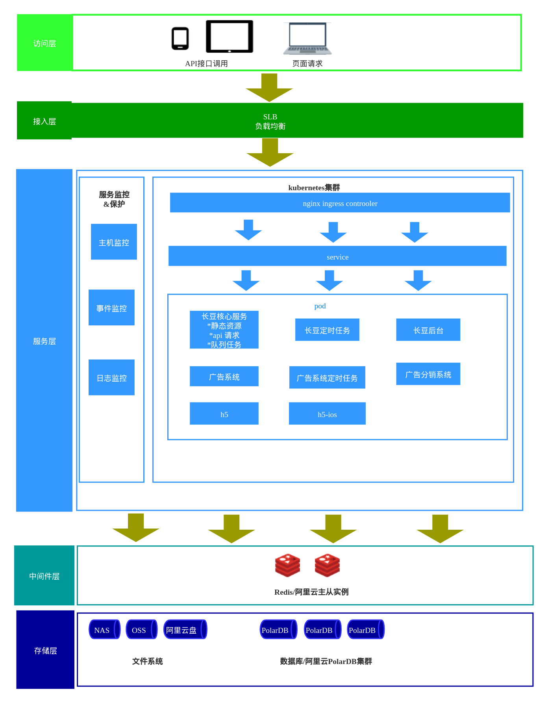
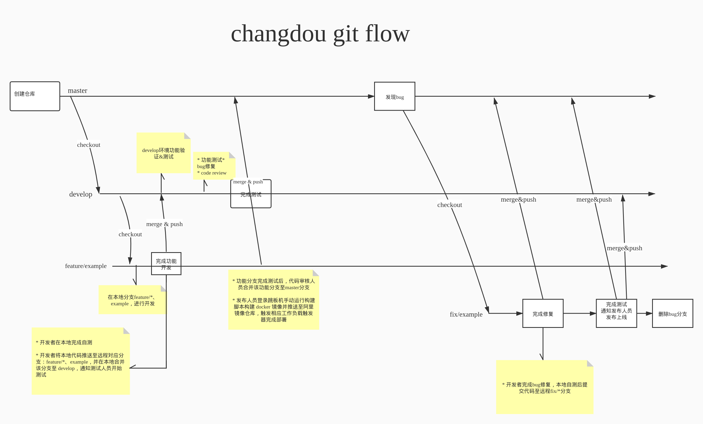
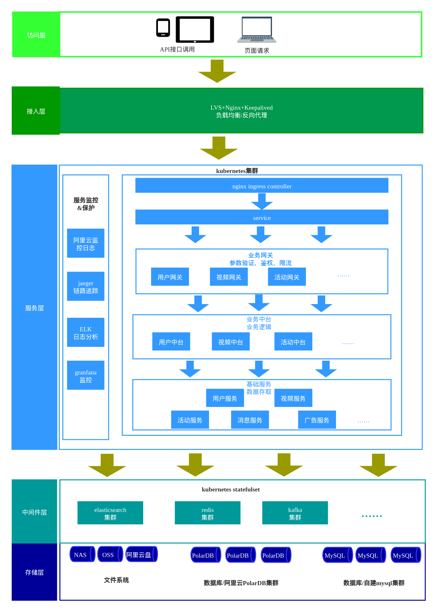
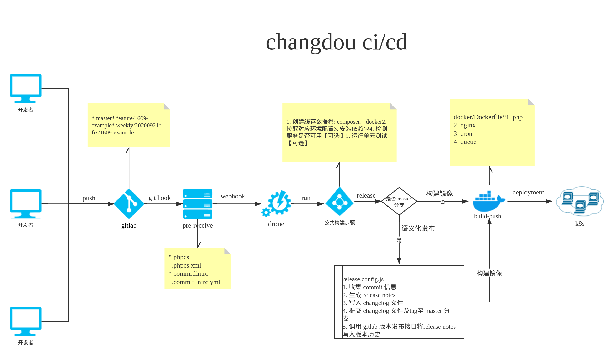
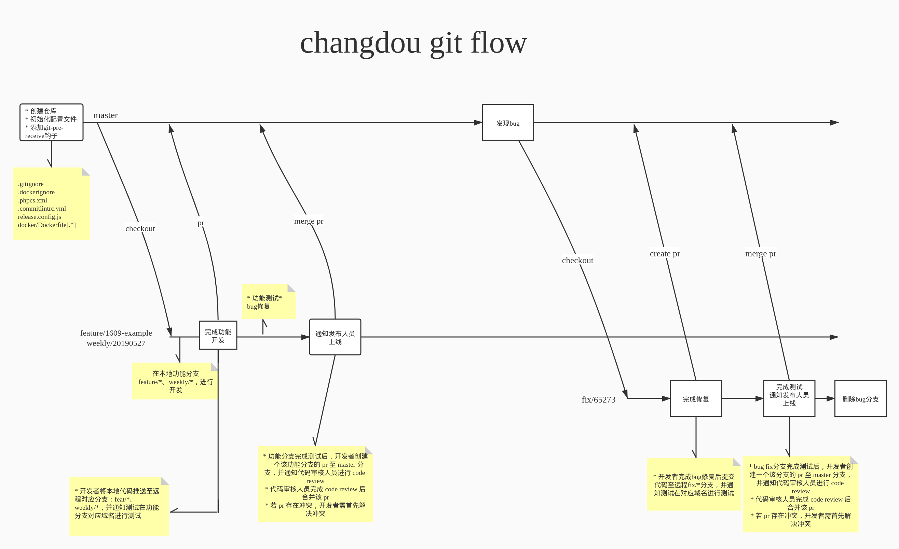

# 长豆短视频架构及工作流优化的探索

伴随长豆短视频业务的迅速发展，对项目并发访问、数据存储、搜索、报表分析等业务涉及的服务带来了更高的挑战；为应对今后更高的日活带来的并发、数据存储、查询等压力，为现有及未来业务提供可靠的基础服务支撑；在此对服务器整体架构、存储方案、中间件、工作流等方面提一些优化建议。

## 目录

- [as-is](#as-is)
  - [服务器整体架构](#服务器整体架构-as-is)
    - [接入层](#接入层-as-is)
    - [日志及监控](#日志及监控-as-is)
  - [CI/CD](#CI/CD-as-is)
  - [工作流](#工作流-as-is)
- [to-be](#to-be)
  - [服务器整体架构](#服务器整体架构-to-be)
    - [接入层](#接入层-to-be)
    - [日志及监控](#日志及监控-to-be)
  - [CI/CD](#CI/CD-to-be)
  - [工作流](#工作流-to-be)
- [参考文档](#参考文档)

## as-is

目前的现状

### 服务器整体架构 as-is

#### 接入层 as-is

阿里云SLB

#### 日志及监控 as-is

阿里云日志、监控服务

#### CI/CD as-is

<https://note.youdao.com/ynoteshare1/index.html?id=13adcdfe8a2e132ddfcb6e0bb954f787&type=note>

#### 工作流 as-is

## to-be

今后演进的规划

### 服务器整体架构 to-be

#### 接入层 to-be

阿里云 SLB 整体方案已经很成熟可靠，这里的变更更多考虑的是可定制及成本，优先级较低，后续自建可采用高可用方案 LVS+Nginx+Keepalived 进行搭建

#### 日志及监控 to-be

jaeger、elk、granfana做为阿里云监控日志的完善和补充

#### CI/CD to-be

#### 工作流 to-be

## 参考文档

* github工作流：<https://guides.github.com/introduction/flow/>